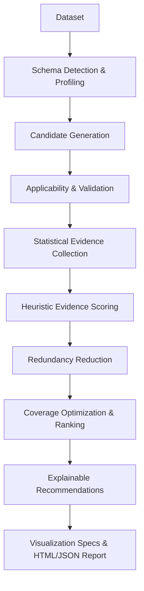

# Nancora

> You bring the data. Nancora brings the analytical direction.

[](https://pypi.org/project/nancora/)
[](https://pypi.org/project/nancora/)
[](https://opensource.org/licenses/MIT)
[](https://github.com/nancora/nancora/actions/workflows/ci.yml)

**Nancora** is a Python data-science intelligence layer that determines which analyses are worth your attention.

Rather than flooding data scientists with dozens of arbitrary charts or requiring manual writing of repetitive exploratory scripts, Nancora profiles a dataset, evaluates candidate statistical analyses based on evidence and data quality, deduplicates redundant work, ranks recommendations using an explainable heuristic, and generates actionable reports.

---

## What is Nancora?

When presented with a new dataset, data scientists face an **analytical decision problem**: a dataset with 20 columns supports hundreds of possible summary statistics, correlation pairs, distribution tests, trend checks, and anomaly screens. Most of these analyses yield trivial or uninformative results.

Existing computational tools (Pandas, NumPy, SciPy) compute whatever statistics you request. Existing plotting libraries (Matplotlib, Plotly) render whatever charts you request. Automated EDA tools often take the "generate everything" approach, rendering massive HTML pages packed with redundant charts.

**Nancora sits on top of the scientific Python ecosystem as an analytical decision layer.** It evaluates candidate analyses before computing or rendering them, prioritizing directions with genuine statistical signal and penalizing uninformative or redundant exploration.

```
+-------------------------------------------------------------------------------+
|                             DATA SCIENCE STACK                                |
+-------------------------------------------------------------------------------+
|  Nancora       --> Decides WHICH analyses are worth performing                |
|  Pandas/SciPy  --> Performs statistical COMPUTATION                           |
|  Matplotlib    --> Performs visual RENDERING                                  |
+-------------------------------------------------------------------------------+
```

---

## Why Nancora?

Traditional exploratory data analysis requires manual trial-and-error:

```
Traditional EDA Workflow:
Dataset  ==>  Manually guess analyses  ==>  Write Pandas/SciPy code  ==>  Plot charts  ==>  Filter noise manually
```

Nancora automates the **selection and prioritization** phase with a transparent, deterministic pipeline:



### Key Differences

| Capability / Focus | Traditional AutoEDA | Nancora |
| :--- | :--- | :--- |
| **Primary Goal** | Generate as many charts as possible | Select and rank only high-signal analyses |
| **Decision Mechanism** | Hardcoded visual templates | Evidence-backed heuristic scoring (0–100) |
| **Redundancy Control** | Minimal (shows repetitive pairs) | Active family & variable overlap reduction |
| **Explainability** | None (black-box charts) | Transparent decision traces & score breakdowns |
| **Target Awareness** | Separate tool or unguided | Guided exploration toward target variables |
| **Dependencies** | Heavy / LLM wrappers | Lightweight, offline-first, pure Python/Pandas/SciPy |

---

## How Nancora Works

Nancora operates as a deterministic 10-stage execution pipeline:

1. **Schema Detection**: Profiles input column data types (`numeric`, `categorical`, `boolean`, `datetime`, `identifier`) and calculates dataset shape and missingness statistics.
2. **Candidate Generation**: Proposes candidate analyses across univariate, bivariate, temporal, and data-quality categories.
3. **Applicability Filtering**: Validates dataset requirements (minimum row count, variable count bounds, column type compatibility).
4. **Evidence Collection**: Runs targeted statistical checks (IQR outlier rates, Pearson/Spearman correlation coefficients, ANOVA/chi-square statistics, uniqueness ratios) to gather empirical evidence.
5. **Heuristic Scoring**: Combines base heuristic priors with evidence strength, data quality penalties, and sample support into an explainable 0–100 score.
6. **Redundancy Reduction**: Identifies and suppresses redundant analyses sharing common variable pairs or analytical families.
7. **Coverage Optimization**: Boosts top candidates that expand coverage to previously unanalyzed columns.
8. **Ranking & Selection**: Sorts candidates by final score and selects the top $N$ recommendations (default: 10).
9. **Explanation Synthesis**: Constructs step-by-step decision traces and human-readable evidence summaries.
10. **Visualization & Reporting**: Emits structured result objects, Matplotlib plot specifications, JSON payloads, or self-contained HTML reports.

---

## Installation

Install Nancora from PyPI:

```bash
pip install nancora
```

### Optional Extras

For Excel (`.xlsx`) or Parquet (`.parquet`) file loading support via CLI:

```bash
pip install "nancora[excel]"
pip install "nancora[parquet]"
```

### Development Installation

To clone and install Nancora locally with testing dependencies:

```bash
git clone https://github.com/nancora/nancora.git
cd nancora
pip install -e ".[dev]"
```

---

## Quick Start

### 1. Unsupervised Exploration

Pass any Pandas `DataFrame` to `nc.explore()` to discover the most valuable analytical directions:

```python
import pandas as pd
import nancora as nc

df = pd.DataFrame({
    "age": [21, 25, 31, 42, 55, 62, 29, 35],
    "income": [25000, 35000, 50000, 70000, 90000, 115000, 48000, 62000],
    "city": ["Surat", "Surat", "Mumbai", "Delhi", "Mumbai", "Delhi", "Surat", "Mumbai"],
})

# Explore dataset
result = nc.explore(df)

# Print recommendations summary
print(result)
```

In a **Jupyter Notebook**, simply evaluating `result` renders a rich, interactive HTML summary table directly in your notebook output cell.

### 2. Target-Aware Exploration

If you have a primary variable of interest (e.g., customer churn, sales amount, diagnostic outcome), specify `target`:

```python
result = nc.explore(df, target="income")
```

Nancora prioritizes candidate analyses that investigate relationships between features and the target variable.

---

## Core Features

* **Automatic Dataset Profiling**: Detects statistical data types, missing rates, duplicate rows, and column cardinality.
* **Evidence-Backed Scoring**: Evaluates candidate analyses on a 0–100 score scale using empirical statistics.
* **Target-Aware Analysis**: Adjusts priors to focus on bivariate and group relationships involving a designated target column.
* **Redundancy Suppression**: Prevents output bloat by suppressing overlapping candidate analyses.
* **Explainable Recommendations**: Provides full mathematical score breakdowns explaining why each analysis was selected or skipped.
* **Automatic Plot Specification**: Generates Matplotlib-ready visual specs (`hist`, `bar`, `scatter`, `box`, `line`) for top-ranked recommendations.
* **HTML & JSON Export**: Export reports to standalone HTML files or serialize results to structured JSON.
* **Command-Line Interface (CLI)**: Profile datasets and generate reports directly from the terminal.
* **Deterministic & Offline-First**: No network dependencies, no external APIs, and no non-deterministic LLM output.

---

## Analysis Capabilities

Nancora evaluates ten built-in analysis families across dataset, univariate, bivariate, and target-focused categories:

| Analysis ID | Type | Target Requirements | Description & Evidence Used | Visual Spec |
| :--- | :--- | :--- | :--- | :--- |
| `missingness_analysis` | Dataset | Any | Analyzes cell missing rates across columns. Penalized (-25) when missingness is 0%. | Bar chart |
| `cardinality_analysis` | Univariate | Any | Detects high uniqueness ratios and primary key candidates. | Bar chart |
| `numeric_distribution` | Univariate | Numeric | Analyzes skewness, kurtosis, mean, and standard deviation. | Histogram |
| `categorical_distribution` | Univariate | Categorical / Boolean | Measures class balance and level frequency distributions. | Bar chart |
| `outlier_analysis` | Univariate | Numeric (N >= 8) | Screens for extreme values using Interquartile Range (IQR) bounds. | Histogram |
| `correlation_analysis` | Bivariate | Numeric | Computes pairwise Pearson correlation coefficients ($r$). | Scatter / Heatmap |
| `numeric_relationship` | Bivariate | Numeric | Evaluates continuous association between numerical pairs. | Scatter plot |
| `categorical_numeric` | Bivariate | Categorical + Numeric | Compares numeric distributions across categories (ANOVA / group stats). | Box plot |
| `datetime_numeric_trend` | Bivariate | Datetime + Numeric | Analyzes temporal trends and time-series progressions. | Line chart |
| `target_aware` | Bivariate | Requires Target | Directly screens features against a specified target column. | Scatter / Box / Bar |

---

## Explainable Recommendations

Every recommendation returned by Nancora includes a structured decision trace and score breakdown.

```python
# Access top recommendation
rec = result.recommendations[0]

print(f"Analysis: {rec.analysis_id}")
print(f"Variables: {rec.variables}")
print(f"Score: {rec.score}")
print(f"Explanation:\n{rec.explanation}")
```

Example Explanation Output:

```text
Base relevance: +64.0 (Heuristic prior for correlation_analysis)
Target proximity: +0.0 (No target specified)
Relationship / Evidence strength: +16.2 (Strong correlation coefficient r = 0.81)
Information value: +2.1 (Sample size N = 8)
Data quality: +2.0 (Zero missing values)
Coverage: +2.0 (Covers new column 'income')
Complexity: -0.0 (Pairwise analysis penalty)
----------------------------------------
Final score: 86.3
```

---

## Scoring and Ranking

Nancora scores candidates on a 0–100 scale using seven component factors:

$$\text{Score} = \text{Base Prior} + \text{Target Proximity} + \text{Evidence Strength} + \text{Information Value} + \text{Data Quality} + \text{Coverage Boost} + \text{Complexity Penalty}$$

1. **Base Relevance Prior**: Initial prior for the analysis type (e.g., `target_aware`: 78.0, `correlation_analysis`: 64.0, `missingness_analysis`: 50.0).
2. **Target Proximity**: $+14.0$ boost if candidate involves the designated target variable.
3. **Relationship / Evidence Strength**: Dynamic shift based on empirical signal strength (e.g., correlation coefficient $r$, IQR outlier rate, missingness severity). Zero-missingness receives a $-25.0$ penalty.
4. **Information Value**: Evaluates sample support ($\log_{10} N$) and penalizes degenerate distributions (zero variance or near-100% unique strings).
5. **Data Quality**: Penalizes high missing rates in candidate columns.
6. **Coverage Boost**: $+2.0$ boost awarded to candidate analyses that introduce previously unrepresented columns into the top recommendation set.
7. **Complexity Penalty**: Small penalty applied to multi-variable or high-complexity analyses.

> **Disclaimer**: Nancora's scores are explainable ranking heuristics (0–100) designed to prioritize exploratory attention. They are not statistical hypothesis tests or claims of causation. *Correlation does not imply causation.*

---

## Results and Serialization

The `AnalysisResult` object returned by `nc.explore()` provides clean properties and export methods:

```python
result = nc.explore(df)

# Structured properties
profile = result.profile              # Dataset shape, column kinds, missingness stats
recs = result.recommendations         # Prioritized list of selected AnalysisCandidates
insights = result.insights            # Natural language evidence summaries
rejected = result.rejected_candidates # Candidates skipped due to low score or redundancy
trace = result.decision_trace         # Complete decision audit dictionary

# Export formats
json_data = result.to_json(indent=2)  # Machine-readable JSON string
dict_data = result.to_dict()          # Python dictionary representation
result.save("report.html")            # Standalone, self-contained HTML report file
```

---

## Command-Line Interface (CLI)

Nancora includes a built-in command-line tool for exploring datasets directly from the terminal.

### Unsupervised Exploration

```bash
nancora explore data.csv --out report.html
```

### Target-Aware Analysis

```bash
nancora analyze data.csv --target churn_status --out report.html
```

### JSON Output to Stdout

```bash
nancora explore data.csv --json
```

---

## End-to-End Example

```python
import pandas as pd
import nancora as nc

# 1. Load dataset using Nancora IO helper or Pandas
df = nc.read_csv("telecom_churn.csv")

# 2. Run target-aware exploration focused on "churn"
result = nc.explore(df, target="churn", max_analyses=5)

# 3. Print human-readable insights
print("--- Key Insights ---")
for insight in result.insights:
    print(f"• {insight}")

# 4. Save interactive HTML report
result.save("churn_exploration_report.html")
print("Report saved to churn_exploration_report.html")
```

---

## Architecture Overview

```text
src/nancora/
├── __init__.py           # Top-level API exports (explore, analyze, read_csv)
├── cli.py                # Typer-based command-line interface
├── types.py              # Enums (ColumnKind, AnalysisStatus, RejectReason)
├── data/
│   ├── io.py             # File loaders (CSV, Excel, Parquet, JSON)
│   ├── profile.py        # Schema detection & dataset profiling
│   └── schema.py         # ColumnKind classification rules
├── analysis/
│   ├── base.py           # AnalysisCandidate, Evidence, & ScoreBreakdown models
│   ├── registry.py       # Analysis registration & lookup registry
│   └── builtin/          # 10 built-in analysis candidate generators & evidence logic
├── engine/
│   ├── __init__.py       # Exploration pipeline orchestrator (run_pipeline)
│   ├── generate.py       # Candidate generator engine
│   ├── validate.py       # Applicability validator
│   ├── score.py          # Heuristic scoring engine
│   ├── redundancy.py     # Redundancy suppression filter
│   └── rank.py           # Ranking & coverage-based selection algorithm
├── plot/
│   ├── spec.py           # Declarative PlotSpec definition
│   └── render.py         # Matplotlib rendering engine
├── report/
│   └── html.py           # Self-contained Jinja2 HTML report generator
└── result.py             # AnalysisResult output container & Jupyter HTML representation
```

---

## Ecosystem Comparison

| Tool | Focus & Purpose | How Nancora Differs |
| :--- | :--- | :--- |
| **Pandas / NumPy** | Data manipulation and numerical calculation | Nancora uses Pandas for calculation, but decides *which* calculations to run. |
| **SciPy** | Scientific and statistical computation routines | Nancora invokes statistical routines to gather evidence for ranking analyses. |
| **Matplotlib / Plotly**| Graphical chart rendering | Nancora specifies *what* chart is appropriate; Matplotlib handles rendering. |
| **Sweetviz / AutoViz** | Automated EDA report generators | Sweetviz renders fixed templates for every column; Nancora ranks and selects high-signal analyses. |

---

## Design Principles

1. **Evidence over Arbitrary Recommendations**: Analyses are selected based on empirical statistical properties, not static column rules.
2. **Full Explainability**: Every recommendation includes a complete score trace detailing why it was chosen or skipped.
3. **Deterministic Execution**: Given the same dataset and parameters, Nancora produces identical, reproducible results every time.
4. **Offline-First & Lightweight**: Operates locally with zero network calls, zero external API keys, and zero LLM dependencies.
5. **Ecosystem Respect**: Nancora integrates with Pandas, SciPy, and Matplotlib rather than reinventing them.

---

## Verification and Quality

Nancora v0.1.0 is verified against a comprehensive testing and benchmarking suite:

* **57 Automated Unit & Integration Tests**: Passing across Python 3.10, 3.11, and 3.12 (`pytest`).
* **Intelligence Regression Suite**: Validated against synthetic and real-world benchmark datasets.
* **100% Essential Recall**: Achieved across standard benchmark evaluation datasets.
* **Validated Packages**: Distribution artifacts (`.whl` and `.tar.gz`) verified clean via `twine check`.

---

## Roadmap

### Current Version (v0.1.0)
* 10 built-in analysis families covering univariate, bivariate, dataset, and target-focused exploration.
* Deterministic scoring, redundancy reduction, and coverage optimization.
* HTML report generation, JSON serialization, and Matplotlib visualization specs.
* CLI support for CSV, JSON, Excel, and Parquet files.

### Planned for Future Releases
* **v0.2.0**: Multivariate analysis candidates (3+ variables, interaction terms).
* **v0.2.0**: Interactive Plotly backend rendering support for HTML reports.
* **v0.3.0**: Custom analysis registration plugin system.
* **v0.3.0**: Exportable Jupyter notebook (`.ipynb`) generation.

---

## Development & Testing

To run the full test suite locally:

```bash
git clone https://github.com/nancora/nancora.git
cd nancora
pip install -e ".[dev]"
pytest
```

To run the intelligence benchmark harness:

```bash
python -m benchmarks.runner
```

---

## License

Nancora is open-source software licensed under the [MIT License](LICENSE).

---

> You bring the data. Nancora brings the analytical direction.
